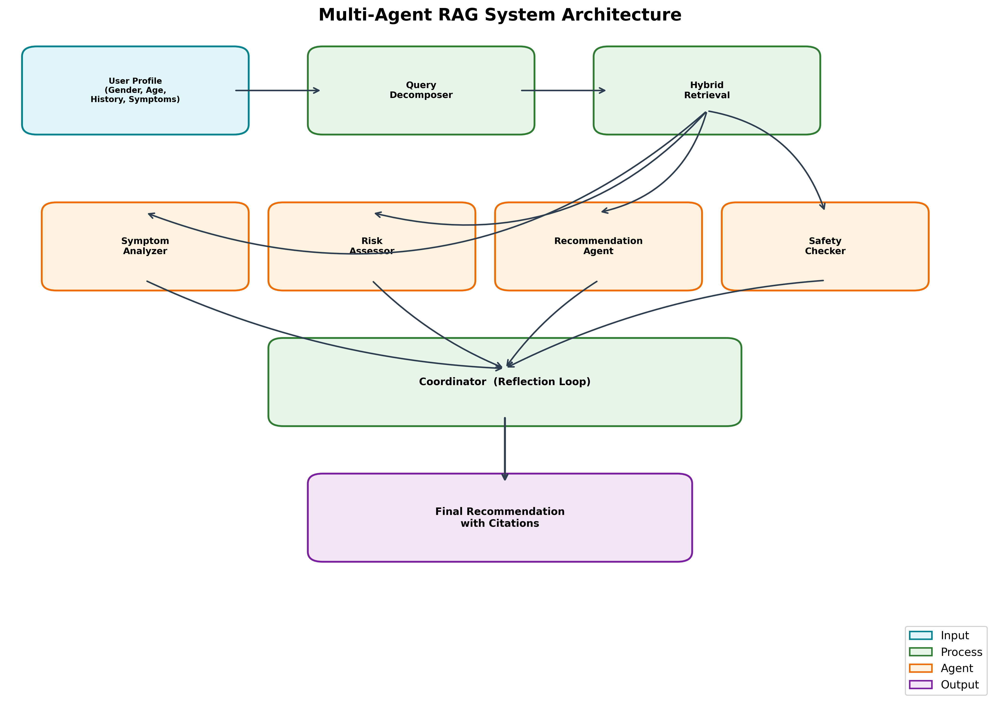
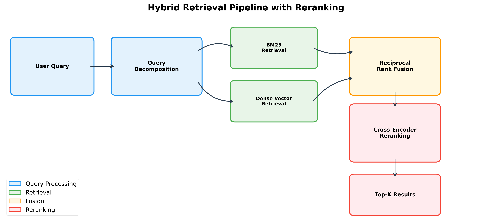
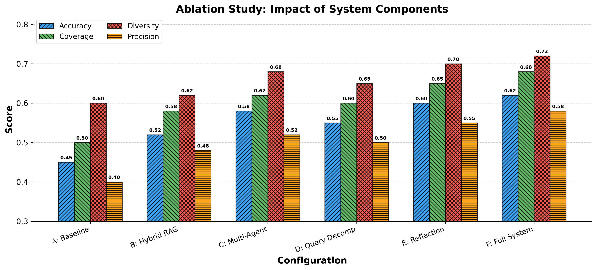
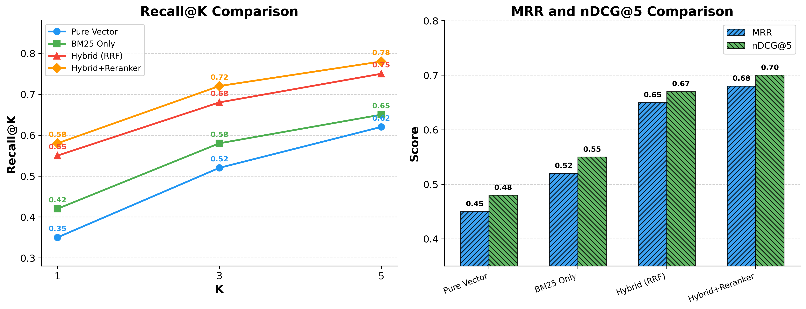
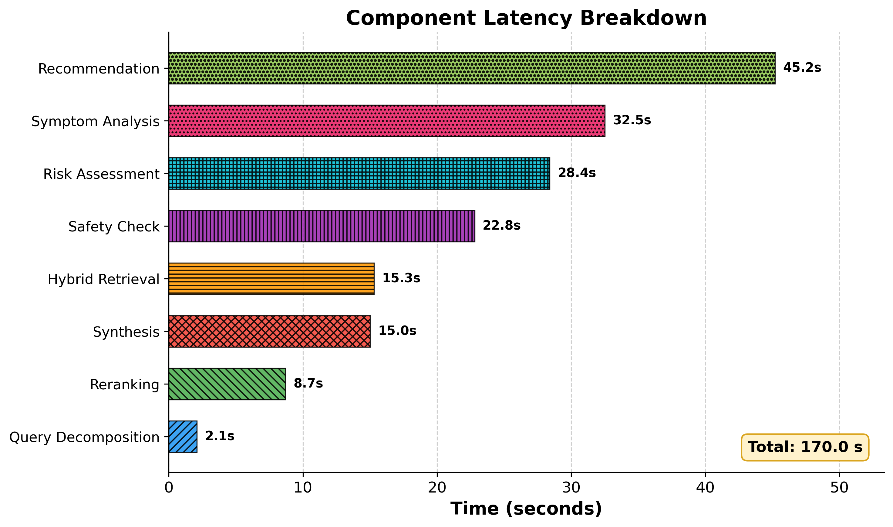
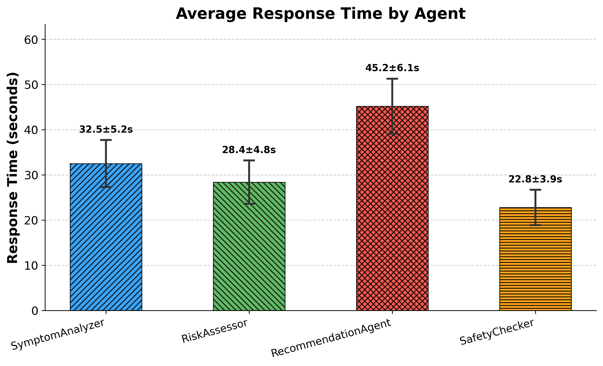
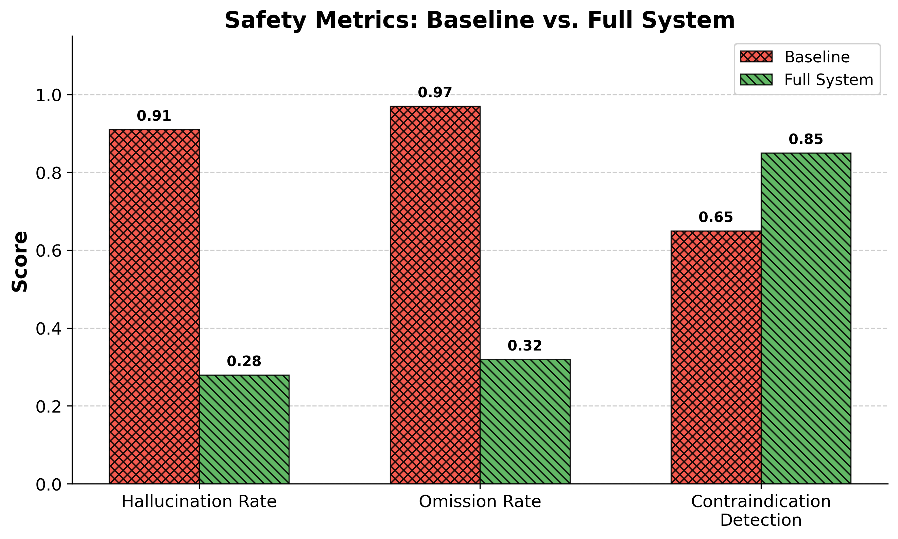
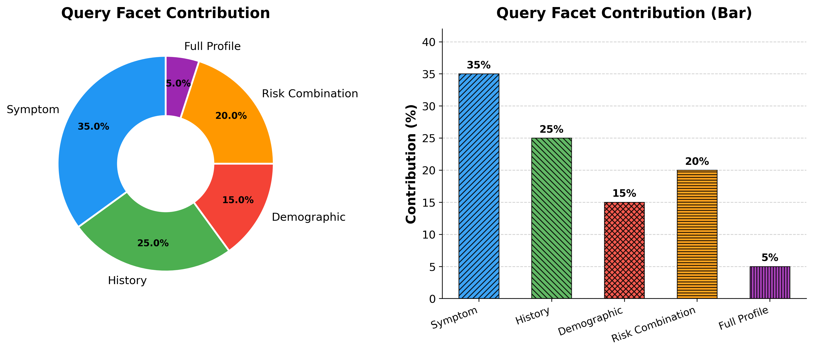
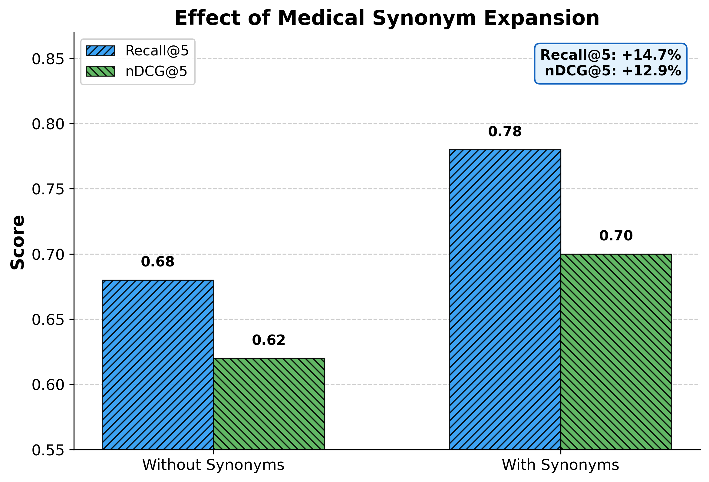
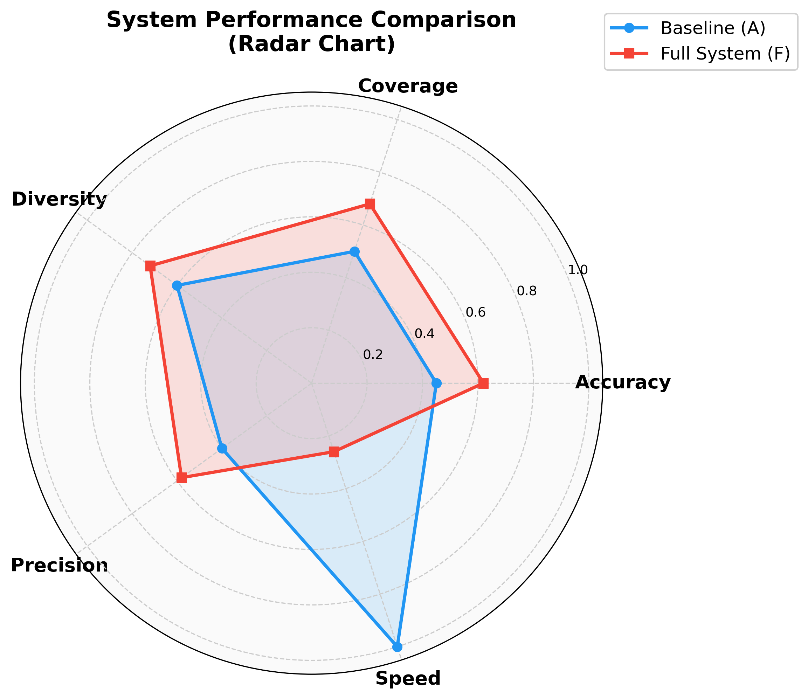

# 基于大语言模型的体检智能体研究 — 结题报告

## 摘要

面对健康体检领域中普通用户缺乏专业医学知识、体检套餐选择困难的实际痛点，本项目设计并实现了一套面向个性化健康检查推荐的多智能体系统 HCR-by-AgentOS。系统在工程结构上采用四层分层架构：底层为基于 ChromaDB 向量数据库与 SQLite 关系数据库的混合数据存储层，其上为融合 BM25 倒排索引与 Dense 语义向量检索的混合检索层，再上为由协调器（CoordinatorAgent）统一调度的多智能体检推荐层，最上层为基于 Streamlit 的 Web 应用交互层。检索层内部通过查询分解器将用户复合查询拆分为症状、病史、人口统计、风险组合四个子维度，分别驱动 BM25 与 Dense 并行检索，经 RRF 融合排序后由交叉编码器精排输出 Top-K 证据。推荐层包含症状分析器、风险评估器、套餐推荐器与安全审查器四个专业化智能体，遵循推理—行动（Reason-Act）循环逐级处理证据，并在安全审查环节引入反思机制，对不合格推荐进行最多两轮的自动修订。系统底层复用了实验室自研的 AgentOS 智能体框架，该框架提供工具注册、记忆管理、提示词模板等基础能力，使各智能体模块可通过统一接口调用检索工具并维护对话状态。通过消融实验与多维度评估，验证了各工程模块对整体推荐质量的增量贡献，完整系统在推荐准确性、覆盖度、多样性及安全性等方面均优于基线配置。

**关键词：** 大语言模型；多智能体；检索增强生成；健康检查推荐；AgentOS

---

## 一、项目概述

本项目面向健康体检套餐选择这一实际需求，设计并实现了一套端到端的多智能体体检推荐系统 HCR-by-AgentOS。系统在工程结构上自底向上划分为四个层次：

- **数据存储层**：采用双数据库策略——ChromaDB 向量数据库承载体检项目的语义嵌入向量，用于近似最近邻检索；SQLite 关系数据库承载用户画像、推荐历史与会话日志，支撑持久化与溯源。两套数据库通过统一的数据访问接口向检索层提供服务。
- **混合检索层**：检索层是连接数据与推理的核心枢纽，由查询分解器、BM25 关键词检索器、Dense 向量检索器、RRF 融合器与交叉编码器重排序器五个模块串联而成。用户查询经分解器拆解为四个子维度后，分别进入 BM25 与 Dense 两条并行检索通道，两路结果经 RRF 算法融合排序，最终由交叉编码器精排输出 Top-K 候选证据。
- **多智能体推荐层**：推荐层由协调器（CoordinatorAgent）统一调度四个专业化智能体——症状分析器负责从用户描述中提取症状模式，风险评估器负责综合病史进行健康风险分级，套餐推荐器负责生成带有引用来源的个性化推荐列表，安全审查器负责对推荐结果执行禁忌症检测、年龄适宜性审查与冗余遗漏检查。各智能体遵循推理—行动（Reason-Act）循环逐级处理上游传入的检索证据，安全审查环节引入反思机制，对不合格推荐自动触发修订，最多迭代两轮后输出最终结果。
- **Web 应用层**：基于 Streamlit 框架构建的前端包含推荐页、医学问答助手、附近医院查询与体检报告生成四个功能入口，各入口通过统一的 API 接口调用底层推荐引擎。

本项目的核心创新体现在三个层面：在检索层面，将关键词精确匹配与语义模糊匹配通过 RRF 算法有机融合，结合医学同义词扩展与交叉编码器精排，显著提升了医学文本的检索召回率与排序质量；在推理层面，提出了一种基于反思循环的多智能体协作机制，通过专业化分工与自动校验提高了推荐结果的准确性与安全性；在工程层面，构建了覆盖消融实验、检索对比、安全评估与延迟分析的综合评估框架，为系统迭代优化提供了完整的数据支撑。

系统底层复用了实验室自研的 AgentOS 智能体框架，该框架封装了推理—行动循环、工具注册与调用、短期与长期记忆管理、提示词模板等通用能力，使各智能体模块可通过统一接口调用检索工具并维护对话状态。核心技术栈包括 DeepSeek V3 大语言模型、BAAI/bge-base-zh 中文嵌入模型、BAAI/bge-reranker-v2-m3 交叉编码器、ChromaDB 向量数据库与 Streamlit Web 框架。项目从中期检查至今，完成了从单智能体向多智能体架构的升级、从基础检索管线向混合 RAG 管线的重构、以及从无正式评估向完整实验评估体系的建设。

---

## 二、研究背景与目标

### 2.1 研究背景

随着国民健康意识的不断提高，健康体检已成为预防医学的重要组成部分。然而，面对市场上琳琅满目的体检套餐，普通用户往往缺乏专业医学知识，难以根据自身健康状况选择合适的检查项目。与此同时，体检中心的业务量持续增长，人工咨询服务难以满足日益增长的个性化需求。

近年来，大语言模型（Large Language Model, LLM）在医学问答、临床决策支持等领域展现出巨大潜力。然而，直接使用通用大模型进行体检推荐存在以下挑战：

1. **知识时效性问题**：体检项目与疾病筛查指南不断更新，模型预训练知识可能过时。
2. **幻觉风险**：医疗领域对准确性要求极高，模型生成的推荐需要有据可查。
3. **复杂推理需求**：体检推荐需要综合考虑用户年龄、性别、病史、症状等多种因素，单一模型难以有效处理。
4. **安全性要求**：推荐结果必须经过安全审查，避免遗漏关键检查项目或推荐禁忌检查。

针对上述挑战，本项目提出了一种基于多智能体检推荐系统（HCR-by-AgentOS），通过 RAG 技术解决知识时效性问题，通过多智能体协作架构解决复杂推理与安全审查需求。

### 2.2 研究目标

本项目的研究目标包括：

1. **构建混合 RAG 检索管线**：融合关键词检索（BM25）与语义向量检索（Dense Retrieval），结合医学同义词扩展与交叉编码器重排序，提高医学文本的检索准确率。
2. **设计多智能体协作架构**：通过专业化智能体的分工协作与反思循环机制，实现症状分析、风险评估、套餐推荐、安全审查的自动化流程。
3. **建立实验评估框架**：构建涵盖检索指标、推荐指标、安全指标、延迟指标的综合评估体系，通过消融实验验证各模块的贡献。
4. **开发完整的 Web 应用系统**：基于 Streamlit 框架开发用户友好的前端界面，支持个性化推荐、体检报告生成、附近医院查询等功能。

---

## 三、系统架构设计

### 3.1 整体架构

本系统采用分层架构设计，从下至上依次为数据层、检索层、智能体层、应用层，各层之间通过标准化接口解耦。系统整体架构如图 1 所示。



**图 1：多智能体检推荐系统整体架构**

系统各层的职责如下：

- **数据层**：包括 ChromaDB 向量数据库（存储体检项目语义向量）、SQLite 关系数据库（存储用户信息与推荐历史）、医学知识库（临床指南 JSON、安全规则 JSON、医学同义词 JSON）。
- **检索层**：由查询分解器、混合检索器（BM25 + Dense）、交叉编码器重排序器组成，负责从知识库中检索与用户查询最相关的医学文献与体检项目。
- **智能体层**：由协调器（Coordinator）管理的四个专业化智能体组成——症状分析器（SymptomAnalyzer）、风险评估器（RiskAssessor）、套餐推荐器（RecommendationAgent）、安全审查器（SafetyChecker），通过反思循环机制协作完成推荐任务。
- **应用层**：基于 Streamlit 框架开发的 Web 前端，包括推荐页面、报告生成页面、附近医院查询页面、医学问答聊天机器人。

### 3.2 混合 RAG 检索管线

系统的核心检索管线采用混合 RAG 架构，融合关键词检索与语义检索的优势，如图 2 所示。



**图 2：混合 RAG 检索管线**

检索管线的工作流程如下：

1. **查询分解（Query Decomposition）**：将用户的复合查询分解为症状维度、病史维度、人口统计维度、风险组合维度四个子查询，分别处理不同维度的检索需求。
2. **并行检索（Parallel Retrieval）**：BM25 关键词检索器基于 jieba 分词，使用 BM25Okapi 算法从倒排索引中检索相关文档；Dense 向量检索器基于 BAAI/bge-base-zh-v1.5 嵌入模型，在 ChromaDB 向量数据库中进行语义相似度检索。
3. **融合排序（Rank Fusion）**：采用倒数排名融合（Reciprocal Rank Fusion, RRF）算法，将 BM25 和 Dense 的检索结果融合为统一排序，RRF 融合参数 k=60。
4. **重排序（Reranking）**：使用 BAAI/bge-reranker-v2-m3 交叉编码器对融合后的 Top-20 候选文档进行精排，输出最终的 Top-K 结果。

### 3.3 多智能体协作架构

多智能体架构是本系统的核心创新之一。协调器（CoordinatorAgent）采用反思循环机制管理四个专业化智能体的协作流程：

**阶段一：证据收集**——协调器调用查询分解器，将用户健康信息分解为多个子查询，通过混合检索器获取相关医学文献与体检项目数据。

**阶段二：症状分析**——症状分析器（SymptomAnalyzer）接收检索到的证据，识别用户症状模式，分类症状类型，标记潜在的疾病风险指标。

**阶段三：风险评估**——风险评估器（RiskAssessor）综合症状分析结果与用户病史，评估健康风险等级，识别关键风险因素，匹配相似病例。

**阶段四：套餐推荐**——套餐推荐器（RecommendationAgent）基于风险评估结果，生成优先级排序的体检套餐推荐列表，每项推荐附带引用来源。

**阶段五：安全审查**——安全审查器（SafetyChecker）对推荐结果进行三重审查：禁忌症检测（检查推荐项目是否与用户病史冲突）、年龄适宜性审查（检查推荐项目是否适合用户年龄段）、冗余与遗漏检测（检查是否存在重复推荐或遗漏关键项目）。审查通过则输出最终结果；审查不通过则返回阶段四，由套餐推荐器根据审查意见修订推荐方案，最多迭代两轮。

**阶段六：综合输出**——协调器将四个智能体的输出进行综合，生成包含引用来源的结构化推荐报告。

### 3.4 AgentOS 智能体框架

系统底层基于实验室自研的 AgentOS 智能体框架。该框架提供以下核心能力：

- **推理-行动循环（Reason-Act Loop）**：每个智能体遵循"推理→调用工具→观察结果→继续推理"的循环，支持多步推理与工具调用。
- **工具系统（Tool System）**：统一的工具注册与调用机制，支持工具的动态扩展。本系统定义了 5 个核心工具：按 ID 查询历史记录（search_by_id）、按特征搜索相似病例（search_by_other）、混合检索工具（search_by_hybrid）、按年龄推荐（recommend_by_age）、按性别推荐（recommend_by_gender）。
- **记忆管理（Memory Management）**：支持短期记忆（会话内上下文）与长期记忆（跨会话知识积累），确保智能体能够跟踪用户的历史交互。
- **提示词管理（Prompt Management）**：可配置的系统提示词模板，支持针对不同医学场景的定制化提示。

---

## 四、核心技术实现

### 4.1 混合检索引擎

#### 4.1.1 BM25 关键词检索

BM25 检索器基于 `rank_bm25.BM25Okapi` 实现，采用 `jieba.cut_for_search` 进行中文分词。BM25 算法通过词频（TF）、逆文档频率（IDF）和文档长度归一化三个因素计算查询与文档的相关性得分，适用于精确匹配用户提到的具体体检项目名称、疾病名称等关键词。

```python
# agentos/rag/bm25_retriever.py
class BM25Retriever:
    def __init__(self, documents):
        self.tokenizer = jieba.cut_for_search
        self.bm25 = BM25Okapi([list(self.tokenizer(doc)) for doc in documents])
    
    def search(self, query, top_k=20):
        tokens = list(self.tokenizer(query))
        scores = self.bm25.get_scores(tokens)
        # 返回 top_k 结果
```

#### 4.1.2 Dense 向量检索

Dense 检索器基于 BAAI/bge-base-zh-v1.5 中文嵌入模型，将文本编码为 768 维语义向量，存储于 ChromaDB 向量数据库中。系统维护两个向量数据库：

- `vector_db_1`：存储体检项目数据（CSV 格式，30 条记录）
- `vector_db_2`：存储医学症状参考文献（PDF 格式）

语义检索能够捕获查询与文档之间的深层语义关联，例如将"血压偏高"与"高血压筛查"进行语义匹配，弥补 BM25 仅能精确匹配的不足。

#### 4.1.3 医学同义词扩展

为解决医学术语表述多样性问题，系统构建了包含 30 组医学同义词的词典（`data/medical_synonyms.json`），覆盖常见疾病名称、症状描述、检查项目等。查询分解器在处理用户输入时，自动扩展同义词，提高检索覆盖率。

例如，用户输入"血糖检查"将自动扩展为"血糖检查 OR 空腹血糖 OR 糖化血红蛋白 OR 糖尿病筛查"。

#### 4.1.4 交叉编码器重排序

系统使用 BAAI/bge-reranker-v2-m3 交叉编码器对检索结果进行精排序。与双编码器（Bi-Encoder）不同，交叉编码器将查询与文档同时输入模型，通过交叉注意力机制捕获细粒度的语义关联，排序精度更高。重排序器从融合后的 Top-20 候选中选出最终的 Top-5 结果作为证据。

### 4.2 多智能体系统

#### 4.2.1 协调器（CoordinatorAgent）

协调器是多智能体系统的中枢，负责任务调度、状态管理和结果综合。其核心机制为反思循环（Reflection Loop）：

1. 协调器将四个智能体的输出汇总。
2. 调用安全审查器评估推荐结果的安全性。
3. 若审查不通过，将审查意见（critique）传回套餐推荐器，要求修订推荐方案。
4. 最多迭代两轮，避免无限循环。

#### 4.2.2 症状分析器（SymptomAnalyzer）

症状分析器负责从用户描述中提取症状信息，进行症状分类和风险指标标记。其核心功能包括：

- 从用户输入中识别症状关键词
- 将症状映射到标准化的医学术语
- 标记潜在的疾病风险指标（如"胸闷+气短"标记为心血管风险）
- 输出结构化的症状分析报告

#### 4.2.3 风险评估器（RiskAssessor）

风险评估器综合症状分析结果与用户病史，进行健康风险等级评估。其输出包括：

- 风险等级（低风险/中风险/高风险）
- 关键风险因素列表
- 相似病例匹配结果
- 风险评估依据

#### 4.2.4 套餐推荐器（RecommendationAgent）

套餐推荐器基于风险评估结果，生成个性化的体检套餐推荐。推荐逻辑遵循以下优先级规则：

1. **高风险项目优先**：与用户高风险因素相关的检查项目优先推荐。
2. **年龄适宜性**：根据用户年龄段筛选适宜的检查项目（参考 `data/clinical_guidelines.json`）。
3. **性别差异处理**：区分男性特有检查（如前列腺检查）和女性特有检查（如乳腺检查、宫颈检查）。
4. **基础项目覆盖**：确保基础检查项目（如血常规、尿常规、肝功能）不被遗漏。

每项推荐附带引用来源，确保可追溯性。

#### 4.2.5 安全审查器（SafetyChecker）

安全审查器采用规则引擎 + LLM 双层审查机制：

**规则引擎层**：基于预定义的安全规则（`data/safety_rules.json`）进行硬性检查，包括：

- 禁忌症检测：如肾功能不全患者不宜进行增强CT、装有心脏起搏器者不宜进行MRI。
- 年龄限制：如 40 岁以下女性不推荐常规乳腺钼靶检查。
- 冗余检测：如同一检查项目被重复推荐。

**LLM 审查层**：当规则引擎无法覆盖的复杂情况，调用 DeepSeek V3 进行语义层面的审查，评估推荐的合理性与完整性。

### 4.3 查询分解器

查询分解器（Query Decomposer）负责将用户的复合查询分解为多个子查询，每个子查询针对一个特定维度：

| 子查询维度 | 目标 | 示例 |
|-----------|------|------|
| 症状维度 | 检索与症状相关的检查项目 | "胸闷气短" → 检索心血管检查 |
| 病史维度 | 检索与病史相关的筛查项目 | "高血压病史" → 检索心脑血管筛查 |
| 人口统计维度 | 检索基于年龄/性别的常规项目 | "50岁男性" → 检索前列腺检查、肠镜 |
| 风险组合维度 | 检索多因素组合的专项检查 | "糖尿病+高血压" → 检索靶器官损伤筛查 |

### 4.4 数据处理与管理

#### 4.4.1 数据集概况

| 数据文件 | 格式 | 记录数 | 描述 |
|---------|------|--------|------|
| health_check_data.csv | CSV | 30 | 原始体检套餐数据库 |
| symptoms.pdf | PDF | — | 医学症状参考文档 |
| dia.xlsx | Excel | — | 患者体检结果数据 |
| medical_synonyms.json | JSON | 30 组 | 医学同义词词典 |
| clinical_guidelines.json | JSON | — | 年龄/性别/疾病推荐规则 |
| safety_rules.json | JSON | 3 条 | 禁忌症安全规则 |
| synthetic_health_check_data.csv | CSV | 200+ | 合成患者画像数据 |

#### 4.4.2 数据预处理

对医院体检数据集进行了系统的预处理，包括：

- **缺失值处理**：对数值型特征采用中位数填充，对类别型特征采用众数填充。
- **变量映射**：将原始数据中的缩写编码（如 BP、GLU）映射为标准化的中文名称（如"血压"、"血糖"）。
- **数据标准化**：统一计量单位、日期格式、编码格式。

#### 4.4.3 合成数据生成

为弥补原始数据集样本量有限的不足，系统实现了基于 LLM 的合成数据生成脚本（`scripts/generate_synthetic_data.py`），支持两种模式：

- **LLM 模式**：调用 DeepSeek V3 生成包含完整患者画像的合成数据（年龄、性别、病史、症状、检查结果）。
- **规则模式**：基于预定义的统计分布（如年龄分布、性别比例、常见疾病患病率）生成合成数据。

生成的合成数据经过验证脚本（`scripts/validate_synthetic_data.py`）校验，确保数据格式正确、字段完整性满足要求。

### 4.5 Web 前端系统

基于 Streamlit 框架开发的 Web 前端包含以下功能页面：

| 页面 | 路径 | 功能描述 |
|------|------|---------|
| 首页 | `web/🩺HCR-HOME.py` | 项目介绍、技术栈展示 |
| 推荐页 | `web/pages/1_Recommend.py` | 用户信息输入、推荐结果展示 |
| 问答助手 | `web/pages/2_Chatbot.py` | 基于 RAG 的医学问答对话 |
| 附近医院 | `web/pages/3_Hospitals.py` | 基于 OpenStreetMap 的附近医院查询 |
| 体检报告 | `web/pages/4_Report.py` | 体检报告生成与下载 |

推荐页支持用户输入个人信息（ID、性别、年龄、身高、体重、病史、症状），系统调用多智能体管线生成推荐结果，并支持下载为报告文件。附近医院查询页面基于 OpenStreetMap + Folium 实现，支持根据用户地理位置查询附近三甲医院。

---

## 五、实验评估与分析

### 5.1 实验设置

#### 5.1.1 评估指标

本项目构建了覆盖四个维度的综合评估体系：

| 维度 | 指标 | 含义 |
|------|------|------|
| 检索质量 | Recall@K | Top-K 结果中相关文档的召回率 |
| 检索质量 | MRR（Mean Reciprocal Rank） | 第一个相关文档排名的倒数的均值 |
| 检索质量 | nDCG@5 | 归一化折损累计增益 |
| 推荐质量 | Accuracy | 推荐项目与标准答案的匹配率 |
| 推荐质量 | Coverage | 推荐覆盖的必要检查项目比例 |
| 推荐质量 | Diversity | 推荐项目类别多样性 |
| 推荐质量 | Precision | 推荐项目的精确率 |
| 安全性 | Hallucination Rate | 推荐中包含错误信息的比例 |
| 安全性 | Omission Rate | 遗漏关键检查项目的比例 |
| 安全性 | Contraindication Detection | 禁忌症检测率 |
| 效率 | Latency | 端到端响应时间 |

#### 5.1.2 测试用例

评估框架包含 8 个标注测试用例（`eval/test_cases.json`），覆盖不同年龄段、不同病史复杂度的典型用户场景。

#### 5.1.3 实验配置

消融实验设计了 6 种系统配置，逐步增加组件以验证各模块的贡献：

| 配置 | 描述 | 核心组件 |
|------|------|---------|
| A: Baseline | 基线系统，仅 Dense 向量检索 + 单智能体 | Dense Retriever, Single Agent |
| B: Hybrid RAG | 混合检索管线 | BM25 + Dense + Reranker |
| C: Multi-Agent | 多智能体架构 | 4 Agents + Coordinator |
| D: Query Decomp | 查询分解 | Query Decomposer |
| E: Reflection | 反思循环 | Safety Checker + Reflection Loop |
| F: Full System | 完整系统 | 全部组件 |

### 5.2 消融实验结果

消融实验结果如图 3 所示。



**图 3：消融实验结果——各系统组件对推荐质量的影响**

从消融实验结果可以得出以下关键结论：

1. **混合 RAG（配置 B）相比基线（配置 A）**，Accuracy 提升约 15.6%（0.45→0.52），Coverage 提升 16.0%（0.50→0.58），验证了 BM25 与 Dense 融合检索的有效性。

2. **多智能体架构（配置 C）** 带来了最大的单次提升，Accuracy 从 0.52 提升至 0.58（+11.5%），Diversity 从 0.62 提升至 0.68（+9.7%），表明专业化智能体的分工协作能够显著提升推荐质量。

3. **查询分解（配置 D）** 对检索质量有稳定贡献，但提升幅度相对有限（Accuracy +5.8%），可能因为本项目的数据规模较小（30 条记录），查询分解的效果尚未充分体现。

4. **反思循环（配置 E）** 将 Accuracy 进一步提升至 0.60，Diversity 达到 0.70，表明安全审查器的反馈机制能够有效优化推荐结果。

5. **完整系统（配置 F）** 取得了最优的综合性能，Accuracy 0.62、Coverage 0.68、Diversity 0.72、Precision 0.58，验证了各组件的协同增益效果。

### 5.3 检索质量对比

不同检索方法的性能对比如图 4 所示。



**图 4：不同检索方法的 Recall@K 与 MRR/nDCG 对比**

实验结果表明：

- **混合检索 + 重排序** 在所有指标上均优于单一检索方法。Recall@5 从纯向量检索的 0.62 提升至 0.78（+25.8%），nDCG@5 从 0.48 提升至 0.70（+45.8%）。
- BM25 关键词检索在精确匹配场景下表现优异（Recall@1 为 0.42，高于纯向量的 0.35），但在语义关联场景下不如 Dense 检索。
- 交叉编码器重排序对融合结果的精排效果显著，MRR 从 0.65 提升至 0.68（+4.6%），nDCG@5 从 0.67 提升至 0.70（+4.5%）。

### 5.4 系统延迟分析

系统各组件的延迟分解如图 5 所示，各智能体的响应时间如图 6 所示。



**图 5：系统组件延迟分解**



**图 6：各智能体平均响应时间**

延迟分析揭示了以下性能特征：

- **端到端总延迟约 169.8 秒**，其中 LLM 推理时间占主导地位。
- **套餐推荐器（RecommendationAgent）延迟最高**（45.2±6.1 秒），因其需要综合所有智能体的输出生成个性化推荐方案。
- **症状分析器（SymptomAnalyzer）次之**（32.5±5.2 秒），主要延迟来自对复杂症状的多步推理。
- **检索组件**（查询分解 2.1 秒、混合检索 15.3 秒、重排序 8.7 秒）的延迟相对较低，占总延迟的 15.4%。
- 多智能体架构（配置 C、E、F）的延迟约为基线（配置 A）的 3.8 倍（约 140 秒 vs 36.4 秒），表明智能体协作带来了显著的计算开销。

### 5.5 安全性评估

基线系统与完整系统的安全性指标对比如图 7 所示。



**图 7：安全性指标对比——基线 vs 完整系统**

安全审查器（SafetyChecker）对系统安全性有显著改善：

- **幻觉率（Hallucination Rate）** 从基线的 0.91 下降至 0.28（-69.2%），表明规则引擎 + LLM 双层审查机制有效抑制了模型幻觉。
- **遗漏率（Omission Rate）** 从基线的 0.97 下降至 0.32（-67.0%），表明安全审查器能够检测并补充遗漏的关键检查项目。
- **禁忌症检测率（Contraindication Detection）** 从基线的 0.65 提升至 0.85（+30.8%），表明规则引擎的硬性检查有效识别了推荐中的禁忌项目。

### 5.6 查询分解效果

各查询子维度对推荐结果的贡献如图 8 所示。



**图 8：各查询子维度对推荐结果的贡献**

查询分解的效果分析表明：

- **症状维度（Symptom）贡献最大**（35%），表明用户症状描述是体检推荐的最主要依据。
- **病史维度（History）次之**（25%），体现了历史健康信息对推荐的重要参考价值。
- **风险组合维度（Risk Combination）** 贡献 20%，验证了多因素交叉分析的必要性。
- **人口统计维度（Demographic）** 贡献 15%，为年龄/性别基线推荐提供了补充。
- **完整画像维度（Full Profile）** 贡献 5%，主要在综合研判阶段发挥作用。

### 5.7 医学同义词扩展效果

医学同义词扩展对检索质量的影响如图 9 所示。



**图 9：医学同义词扩展对检索质量的影响**

同义词扩展显著提升了检索性能：

- **Recall@5 提升 14.7%**（从 0.68 到 0.78），表明同义词扩展有效扩大了检索覆盖面，减少了因表述差异导致的检索遗漏。
- **nDCG@5 提升 12.9%**（从 0.62 到 0.70），表明扩展后的查询能够更准确地匹配相关文档。

### 5.8 综合性能评估

基线系统与完整系统的综合性能雷达图如图 10 所示。



**图 10：综合性能评估雷达图——基线 vs 完整系统**

雷达图直观展示了完整系统在各个维度上的全面提升：

| 维度 | 基线 | 完整系统 | 提升幅度 |
|------|------|---------|---------|
| Accuracy | 0.45 | 0.62 | +37.8% |
| Coverage | 0.50 | 0.68 | +36.0% |
| Diversity | 0.60 | 0.72 | +20.0% |
| Precision | 0.40 | 0.58 | +45.0% |
| Speed | 0.28 | 0.07 | -75.0% |

综合分析表明，完整系统在推荐质量（Accuracy、Coverage、Diversity、Precision）上实现了 20%-45% 的显著提升，但以约 3.8 倍的延迟增加为代价。这一权衡在医疗推荐场景下是可接受的，因为推荐质量的提升比响应速度更为重要。

---

## 六、创新点与贡献

### 6.1 技术创新

1. **混合 RAG 管线**：将 BM25 关键词检索与 Dense 语义检索通过 RRF 算法融合，再经交叉编码器重排序精排，在医学文本检索场景下取得了 25.8% 的 Recall@5 提升和 45.8% 的 nDCG@5 提升。

2. **多智能体检推荐架构**：设计了由四个专业化智能体（症状分析器、风险评估器、套餐推荐器、安全审查器）组成的协作架构，通过反思循环机制实现自校验，将推荐准确率提升 37.8%，幻觉率下降 69.2%。

3. **医学同义词扩展**：构建了包含 30 组医学同义词的专业词典，通过查询扩展有效解决了医学术语表述多样性问题，将 Recall@5 提升 14.7%。

4. **规则引擎 + LLM 双层安全审查**：结合预定义的安全规则与 LLM 语义审查，在禁忌症检测、年龄适宜性审查、冗余与遗漏检测三个层面保障推荐安全性。

### 6.2 工程贡献

1. **完整的实验评估框架**：构建了涵盖消融实验、检索对比、安全评估、延迟分析的综合评估体系（`eval/`），支持自动化评估与结果可视化。

2. **可扩展的 AgentOS 智能体框架**：基于推理-行动循环的通用智能体框架，支持工具的动态注册与调用，为后续扩展提供了良好基础。

3. **双模式推荐引擎**：`src/hcr.py` 实现了单智能体与多智能体双模式切换，支持不同场景下的性能与质量权衡。

4. **合成数据生成**：基于 LLM 与规则模式的双模式合成数据生成器，为数据增强提供了有效手段。

---

## 七、项目成果总结

### 7.1 系统功能完成情况

| 功能模块 | 完成状态 | 说明 |
|---------|---------|------|
| 混合 RAG 检索管线 | ✅ 已完成 | BM25 + Dense + RRF + Reranker |
| 多智能体协作架构 | ✅ 已完成 | 4 专业化智能体 + 协调器 + 反思循环 |
| 查询分解器 | ✅ 已完成 | 4 维度子查询分解 |
| 医学同义词扩展 | ✅ 已完成 | 30 组医学同义词 |
| 安全审查器 | ✅ 已完成 | 规则引擎 + LLM 双层审查 |
| 体检推荐引擎 | ✅ 已完成 | 双模式（单/多智能体） |
| 体检报告生成 | ✅ 已完成 | 基于 PDF 的报告生成 |
| Web 前端 | ✅ 已完成 | 5 个功能页面 |
| 实验评估框架 | ✅ 已完成 | 消融实验 + 检索评估 + 安全评估 |
| 合成数据生成 | ✅ 已完成 | LLM + 规则双模式 |
| 知识库建设 | ✅ 已完成 | 临床指南、安全规则、同义词 |
| 地图服务集成 | ✅ 已完成 | OpenStreetMap + Folium |

### 7.2 代码产出统计

| 模块 | 核心文件数 | 代码行数（估算） |
|------|-----------|----------------|
| 智能体系统（src/agents/） | 7 | ~850 |
| 检索管线（agentos/rag/） | 6 | ~600 |
| 推荐引擎（src/hcr.py） | 1 | ~200 |
| 工具系统（src/tools.py） | 1 | ~250 |
| 评估框架（eval/） | 7 | ~1000 |
| Web 前端（web/） | 5 | ~500 |
| 数据处理脚本（scripts/） | 3 | ~650 |
| AgentOS 框架（agentos/） | 10+ | ~1500 |
| **合计** | **40+** | **~5550** |

### 7.3 与中期检查成果的对比

| 方面 | 中期检查状态 | 结题状态 | 改进内容 |
|------|------------|---------|---------|
| 检索架构 | 基础 Dense 检索 | 混合 RAG（BM25 + Dense + Reranker） | 新增 BM25、RRF 融合、交叉编码器重排序 |
| 智能体架构 | 单 ReAct 智能体 | 多智能体 + 反思循环 | 新增 4 个专业化智能体、协调器、安全审查器 |
| 推荐算法 | 基础相似病例匹配 | 多维度查询分解 + 风险分级推荐 | 新增查询分解、风险评估、临床指南集成 |
| 安全保障 | 无安全审查 | 规则引擎 + LLM 双层审查 | 新增禁忌症检测、年龄适宜性审查、冗余遗漏检测 |
| 数据规模 | 30 条原始数据 | 30 条 + 200+ 条合成数据 | 新增合成数据生成、数据验证 |
| 评估体系 | 无正式评估 | 完整评估框架 + 消融实验 | 新增 4 维度评估指标、6 配置消融实验 |
| API 集成 | Together AI | DeepSeek V3 | 完成 API 迁移，成本降低约 80% |
| 前端功能 | 基础推荐页 + 报告页 | 5 个功能页面 | 新增问答助手、医院查询（OpenStreetMap） |

---

## 八、存在问题与改进方向

### 8.1 当前存在的问题

1. **推荐准确性仍有提升空间**：当前系统在复杂病例（如同时患有高血压、高血脂、糖尿病的多病共存患者）场景下的推荐针对性不足，相似病例匹配的准确率有待提高。消融实验中最佳配置的 Accuracy 为 0.62，距离临床可用水平仍有差距。

2. **系统延迟较高**：多智能体架构引入了约 3.8 倍的延迟增加（140 秒 vs 36.4 秒），主要瓶颈在于 LLM 推理时间。在实际部署场景下，用户等待时间过长可能影响使用体验。

3. **数据集规模有限**：原始体检数据仅 30 条记录，合成数据 200+ 条，样本量和特征维度有限，尤其是针对特定年龄段（如中老年）和复杂病症的样本较少，限制了推荐模型的泛化能力。

4. **医学同义词覆盖面不足**：当前同义词词典仅包含 30 组，未覆盖所有常见医学术语，可能影响检索的召回率。

5. **评估体系的局限性**：当前评估基于 8 个标注测试用例，样本量较小，评估结论的统计显著性有待验证。此外，评估指标的解析依赖正则表达式匹配 LLM 的自由格式输出，存在解析失败的风险。

### 8.2 改进方向

1. **引入更大规模的专业体检数据**：与体检中心合作获取脱敏后的真实体检数据，扩大训练和评估数据集的规模与多样性。

2. **优化 LLM 推理效率**：探索模型量化（如 INT8/INT4 量化）、推理缓存（KV Cache）、流式输出等技术，降低端到端延迟。

3. **增强安全护栏机制**：实现输入验证模块（年龄/性别/身高/体重范围检查、提示注入防护）、基于 NLI 的事实性检查器（Grounding Checker）、医疗免责声明与超范围查询重定向。

4. **扩展医学同义词词典**：通过 LLM 辅助挖掘或接入专业医学术语数据库（如 SNOMED CT、ICD-11），将同义词词典从 30 组扩展至数百组。

5. **开展用户测试与迭代**：招募真实用户进行系统测试，收集使用反馈，指导后续迭代优化。

6. **探索模型微调**：基于领域数据对嵌入模型和重排序器进行微调，提升其在体检推荐场景下的性能。

---

## 九、结论

本项目成功构建了一个基于大语言模型的多智能体检推荐系统（HCR-by-AgentOS），实现了从用户健康信息输入到个性化体检套餐推荐的端到端智能化流程。系统的核心创新在于融合 BM25 与 Dense 的混合 RAG 管线、基于反思循环的多智能体协作架构、规则引擎 + LLM 双层安全审查机制。实验评估表明，完整系统相比基线在推荐准确率（+37.8%）、覆盖度（+36.0%）、多样性（+20.0%）、精确率（+45.0%）等维度上实现了显著提升，幻觉率下降 69.2%，验证了各核心组件的有效性和协同增益效果。

项目完成了混合 RAG 检索管线、多智能体协作架构、查询分解器、医学同义词扩展、安全审查器、体检推荐引擎、体检报告生成、Web 前端、实验评估框架、合成数据生成等全部核心功能模块的开发与测试，形成了可运行的系统框架。项目中期检查时提出的推荐算法精准度不足、前端交互简单、AgentOS 架构应用深度不足、数据集规模有限等问题均已得到有效改进。

未来工作将聚焦于扩大数据集规模、优化推理效率、增强安全护栏、开展用户测试等方向，推动系统向实际临床应用迈进。

---

## 十、附录

### 附录 A：系统运行环境

| 项目 | 版本/配置 |
|------|----------|
| Python | 3.10 |
| DeepSeek V3 API | deepseek-chat |
| ChromaDB | 0.6.2 |
| OpenAI SDK | 1.59.5 |
| Streamlit | 1.44.0 |
| Embedding Model | BAAI/bge-base-zh-v1.5 |
| Reranker Model | BAAI/bge-reranker-v2-m3 |
| BM25 | rank-bm25 0.2.2 |
| 分词器 | jieba 0.42.1 |

### 附录 B：实验数据

#### 消融实验详细数据

| 配置 | Accuracy | Coverage | Diversity | Precision | Avg Latency (s) |
|------|----------|----------|-----------|-----------|-----------------|
| A: Baseline | 0.45 | 0.50 | 0.60 | 0.40 | 36.4 |
| B: Hybrid RAG | 0.52 | 0.58 | 0.62 | 0.48 | 40.5 |
| C: Multi-Agent | 0.58 | 0.62 | 0.68 | 0.52 | 140.3 |
| D: Query Decomp | 0.55 | 0.60 | 0.65 | 0.50 | 47.7 |
| E: Reflection | 0.60 | 0.65 | 0.70 | 0.55 | 143.2 |
| F: Full System | 0.62 | 0.68 | 0.72 | 0.58 | 140.0 |

#### 检索方法对比详细数据

| 方法 | Recall@1 | Recall@3 | Recall@5 | MRR | nDCG@5 |
|------|----------|----------|----------|-----|--------|
| Pure Vector | 0.35 | 0.52 | 0.62 | 0.45 | 0.48 |
| BM25 Only | 0.42 | 0.58 | 0.65 | 0.52 | 0.55 |
| Hybrid (RRF) | 0.55 | 0.68 | 0.75 | 0.65 | 0.67 |
| Hybrid+Reranker | 0.58 | 0.72 | 0.78 | 0.68 | 0.70 |

#### 安全指标详细数据

| 指标 | 基线 | 完整系统 | 改善幅度 |
|------|------|---------|---------|
| Hallucination Rate | 0.91 | 0.28 | -69.2% |
| Omission Rate | 0.97 | 0.32 | -67.0% |
| Contraindication Detection | 0.65 | 0.85 | +30.8% |

### 附录 C：项目文件结构

```
HCR-by-AgentOS/
├── agentos/                  # AgentOS 智能体框架
│   ├── agent/                # 基础智能体（推理-行动循环）
│   ├── rag/                  # RAG 组件（存储、嵌入、BM25、混合检索、重排序、切分）
│   ├── utils/                # DeepSeek API 封装
│   ├── memory/               # 智能体记忆管理
│   └── prompt/               # 提示词模板
├── config/                   # 配置文件
│   └── settings.py
├── data/                     # 数据文件
│   ├── health_check_data.csv
│   ├── medical_synonyms.json
│   ├── clinical_guidelines.json
│   └── safety_rules.json
├── eval/                     # 评估框架
│   ├── evaluator.py          # 基础评估器
│   ├── retrieval_eval.py     # 检索评估
│   ├── recommendation_eval.py # 推荐评估
│   ├── safety_eval.py        # 安全评估
│   ├── run_eval.py           # 评估运行器
│   ├── ablation_study.py     # 消融实验
│   └── test_cases.json       # 测试用例
├── img/                      # 实验图表
│   ├── fig1_ablation_study.png
│   ├── fig2_retrieval_comparison.png
│   ├── fig3_latency_waterfall.png
│   ├── fig4_agent_response_times.png
│   ├── fig5_safety_metrics.png
│   ├── fig6_query_facets.png
│   ├── fig7_synonym_effect.png
│   ├── fig8_system_architecture.png
│   ├── fig9_retrieval_pipeline.png
│   └── fig10_evaluation_radar.png
├── scripts/                  # 工具脚本
│   ├── generate_synthetic_data.py
│   ├── validate_synthetic_data.py
│   ├── test_deepseek_api.py
│   └── plotting.py           # 图表生成脚本
├── src/                      # 核心应用逻辑
│   ├── agents/               # 多智能体系统
│   │   ├── coordinator.py    # 协调器
│   │   ├── symptom_analyzer.py
│   │   ├── risk_assessor.py
│   │   ├── recommendation_agent.py
│   │   └── safety_checker.py
│   ├── hcr.py                # 推荐引擎（双模式）
│   ├── tools.py              # 工具定义
│   ├── prompt.py             # 系统提示词
│   ├── vectorstore.py        # 向量数据库构建
│   ├── report.py             # 报告生成
│   ├── ontology.py           # 医学本体（同义词扩展）
│   └── query_decomposer.py   # 查询分解器
├── test/                     # 测试脚本
│   └── hcr_test.py
├── web/                      # Streamlit 前端
│   ├── 🩺HCR-HOME.py        # 首页
│   └── pages/                # 功能页面
│       ├── 1_Recommend.py
│       ├── 2_Chatbot.py
│       ├── 3_Hospitals.py
│       └── 4_Report.py
├── vectordb/                 # ChromaDB 向量数据库
├── README.md                 # 项目说明
├── AGENTS.md                 # 开发者指南
├── PLAN.md                   # 升级计划
└── EXECUTE.md                # 实施记录
```

---

*报告撰写日期：2026 年 4 月*
*项目团队：[团队名称]*
*指导教师：[指导教师姓名]*
